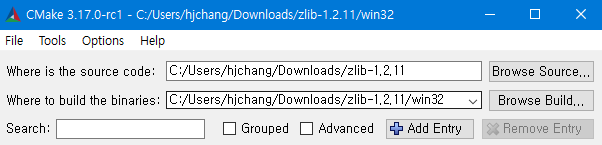
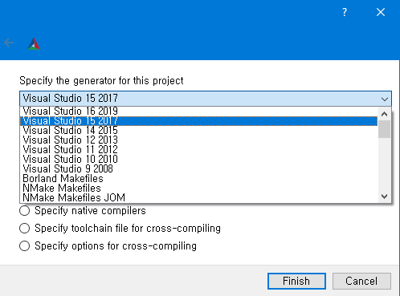
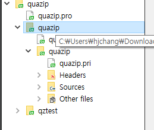
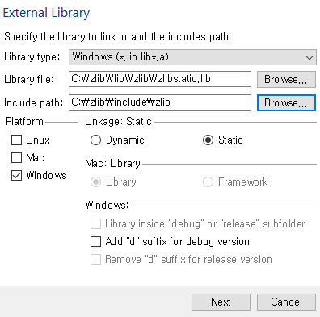
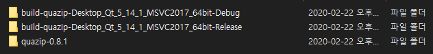

# Building Zlib and Quazip in win10 x64, VS2017

## Zlib
1.  Download [CMake](https://cmake.org/download/)
2.  Download [zlib](https://www.zlib.net/)
3.  Run CMake gui and set path like below\

4.  Click configure, select generator & set optional platform generator as x64\
   
5.  Generate & open zlib.sln in win32 folder
6.  Build debug & release mode 
7.  Go to directory win32/(Debug | Release)
8.  Put zlibd(Debug), zlib(Release) lib/dll somewhere you can find easily

I used installers for installing zlib.\
And it puts zlib.h & zconf.h in C:/zlib/include/zlib, and zlib.dll, zlib.lib, zlibstatic.lib in C:/zlib/lib/zlib\
* Quazip will reference this path to use zlib

## Quazip
* Qt creator should be installed
1. Download [Quazip](https://github.com/stachenov/quazip/releases)
2. Open quazip.pro
3. Right click quazip folder inside quazip and build it which it will fail, showing [C1083 no such file or directory zlib.h] \

4. Right click quazip folder again and select add library
5. Select External library because zlib is not in Quazip build tree
6. Set library file & include path like this \

7. Some paths will be added to quazip.pro file, save & build as Debug/Release mode
8. Go to parent directory of folder quazip-(version), Debug/Release folder will be there 
9. For the release, go to release folder/quazip/release, 
* quazip.dll is required to run application 
* quazip.lib is required to build application
10. For the debug, go to debug folder/quazip/debug, 
* quazipd.dll & quazipd.lib is required as mentioned in step No.9
* do not use release version of quazip.dll in debug mode as it will crash
